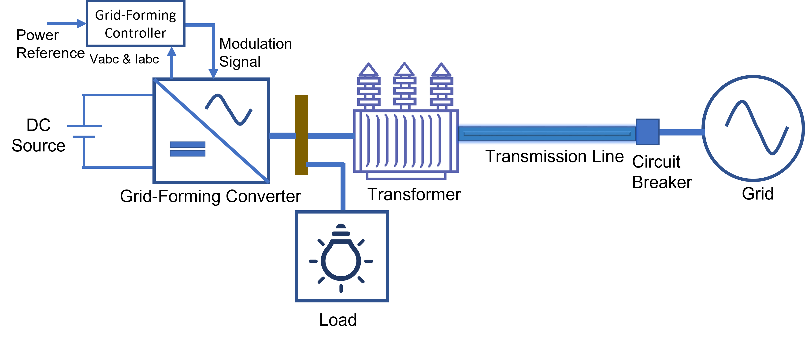
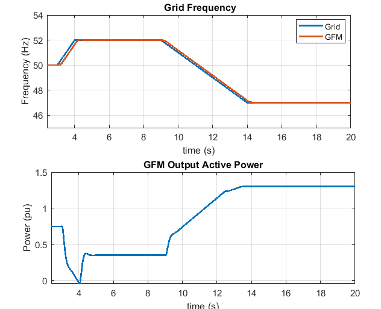
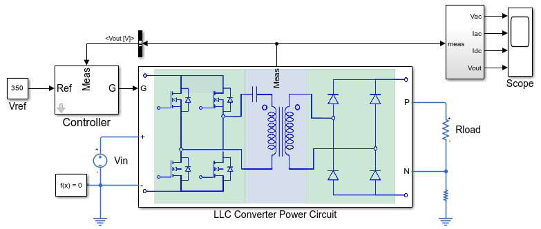
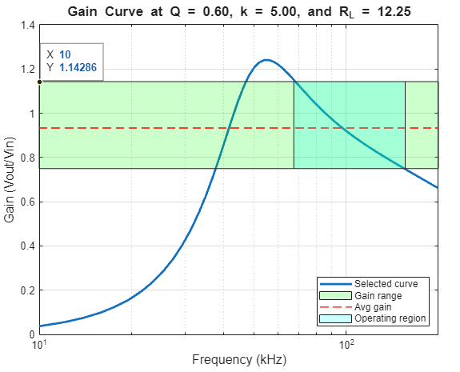

# Power Converter Circuit and Control Design with Simscape

Power converters are fundamental components in various electrification applications. 
This repository provides tools and workflows to design and analyze different power 
converter configurations and control techniques.

## 📖 Table of Contents

- Overview
- [Grid-Forming Converter Design](https://viewer.mathworks.com/addons/131783/25.2.1.2/files/ScriptData/GridFormingConverter/SupportingFiles/GridFormingConverterMain.m)  
- [LLC Resonant Converter Design](https://viewer.mathworks.com/addons/131783/25.2.1.2/files/ScriptData/LLCConverter/SupportingFiles/LLCResonantConverterFullBridgeMain.m)  
- System Level Design Solution
    - Microgrid Design with Simscape
    - Renewable Energy Integration Design with Simscape
- Prerequisites
- Setup 

---

## 🌍 Overview

This repository provides workflows for modeling, simulating, and analyzing power 
converter circuits and control systems using Simscape Electrical. It supports the 
design and simulation of various converter topologies and control algorithms for grid 
modernization and transportation electrification applications.

---

## ⚡ Engineering Solutions

## Grid-Forming Converter Design
-----------------------------
<table>
  <tr>
    <td class="text-column" width=1200>Modern power systems face reduced inertia and limited 
    short-circuit current due to increased use of converter-based resources and 
    fewer synchronous machines. Grid-forming (GFM) converters 
    address these issues by emulating synchronous machine dynamics, providing inertia, 
    damping, and enhanced control of active and reactive power.
    </td>
  </tr>
</table>
<table>
  <tr>
    <td class="image-column" width=900></td>
  </tr>
</table>
<table>
  <tr>
    <td class="text-column" width=600>The GFM design solution shows you how 
    to develop and test a grid-forming (GFM) converter control. The design solution 
    allows you to: 
   <ul style="padding-left: 30px; text-indent: -20px;">
  <li>Design a generic GFM converter and analyze its transient response.</li>
  <li> Implement virtual synchronous and droop control methods to emulate inertia and enhance stability.</li>
  <li>Apply virtual impedance and current limiting fault-ride through methods.</li>
  <li>Adapt the design to a wide range of network strengths.</li>
  <li>Verify conformance to grid code GC0137.</li>
</ul>
    </td>
    <td class="image-column" width=600></td>
  </tr>
</table>

## LLC Resonant Converter Design
----------------------------
<table>
  <tr>
    <td class="text-column" width=1200>This design solution enables you to design and analyze a full-bridge LLC resonant 
    converter. The workflow guides you through developing the converter to meet your 
    specifications by plotting gain curves for various load conditions, quality factors, 
    and inductor ratios. 
    </td>
  </tr>
</table>
<table>
  <tr>
    <td class="image-column" width=1100></td>
  </tr>
</table>
<table>
  <tr>
    <td class="text-column" width=600>The design solution enables you to: 
<ul style="padding-left: 30px; text-indent: -20px;">
 <li>Develop an LLC converter that meets your specifications.</li>
 <li>Plot gain curves for different loads, quality factors, and inductor ratios.</li>
 <li>Optimize performance by adjusting quality factor and inductor ratio.</li>
 <li>Linearize the plant for control design using time-domain simulation.</li>
 <li>Design and tune the controller compensator to meet performance targets.</li>
 <li>Estimate component power loss and calculate overall efficiency with support functions.</li>
</ul>
    </td>
    <td class="image-column" width=600></td>
  </tr>
</table>

---

## 🛠️ Prerequisites

- MATLAB R2025b or later
- Simscape and Simscape Electrical

---

## 🚀 Setup

1. Clone or download the repository.
2. Add the folder to your MATLAB path.
3. Open PowerConverterCircuitAndControlDesignWithSimscape.prj to get started.
4. Use project shortcut buttons in the toolstrip to access examples.
--------------------------------------------------------

© 2023–2026 The MathWorks, Inc.

